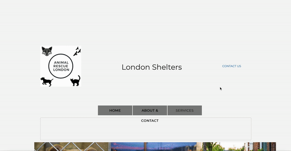

# CodeFirstGirls-HTML
This is a project in partnership with Code First Girls, you will find here our first attempt at a website. We have chosen to work on Animal Shelters around London. Have a good visit. :)

<body class="wheatbackground"> 
  
  

<!-- PROJECT LOGO -->
 

  

<!-- TABLE OF CONTENTS -->
## Table of Contents

* [About the Project](#about-the-project)
      * [Built With](#built-with)
* [Usage](#usage)
* [Contact](#contact)
* [Acknowledgements](#acknowledgements)

<!-- ABOUT THE PROJECT -->
## About The Project

This is a project in partnership with Code First Girls, you will find here our first attempt at a website. We have chosen to work on Animal Shelters around London. Have a good visit. :)

### Built With

* 
* 
* 

## Usage

This gif helps you understand how we created this website and what it looks like. 

<!-- CONTACT -->
## Contact

Should you want to contact us to have more information about the project or anything, you will be able to find us on our LinkedIn listed below: 

Barbara - (https://www.linkedin.com/in/barbara-balogun-168354108/)
Emily - (https://www.linkedin.com/in/barbara-balogun-168354108/)
Marie - (https://www.linkedin.com/in/marie-desaules-7aa496183/)

Project Link: [https://github.com/Babsyi/CodeFirstGirls-HTML](https://github.com/Babsyi/CodeFirstGirls-HTML)

<!-- ACKNOWLEDGEMENTS -->
## Acknowledgements

Thank you Code First Girls and Aiimi for this course.

* 
* 
